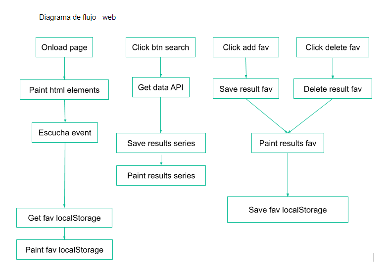

# Módulo-2-evaluación-final-rosannablanco

El ejercicio consiste en desarrollar una aplicación web de búsqueda de series de TV, que nos permite
des/marcar las series como favoritas y guardarlas en local storage.

## Requisitos

Necesitas tener instalado [Node.js](https://nodejs.org/) y [Gulp](https://gulpjs.com) para trabajar.

## Iniciar proyecto

1. Descarga o clona el repositorio
2. Ten instalado node
3. Instala las dependencias locales con `npm install`
4. Arranca el kit con `npm start`
5. Se ejecuta la página

## Diagrama de flujo

## Cómo funciona

1. Introducir titulo de serie en el campo de texto
2. Click en el botón buscar
3. Se muestra un listado de series con la palabra introducida en el campo de texto
4. Desde el listado de series puedes añadir/borrar favoritos
5. Al añadir favoritos se irán mostrando a la izquierda, las series favoritas que vas añadiendo desde el listado serie.
6. Puedes borrar favoritos desde el listado de las series como en el listado de favoritos
7. Si haces una nueva busqueda el listado favorito continuará mostrandose en la pantalla y si en la busqueda de series hay alguna que ya está en el listado favoritos se mostrará con una clase de estilos diferente.
